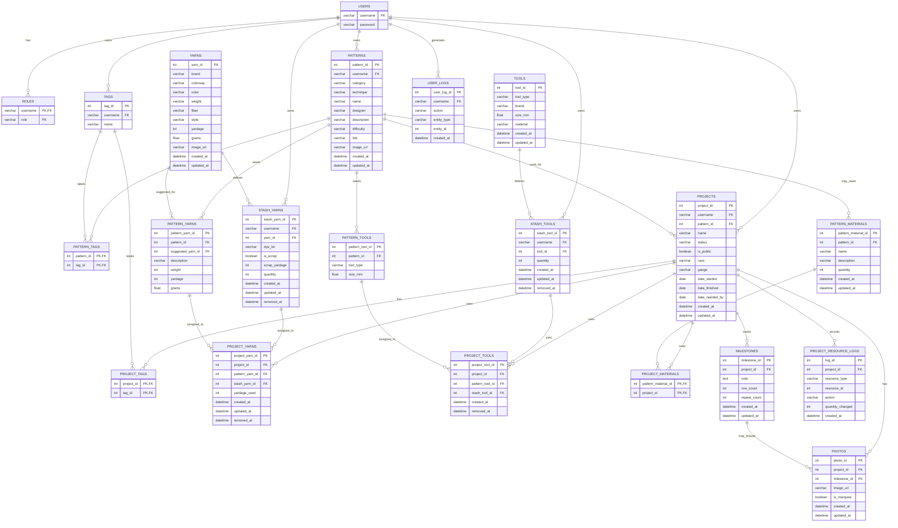

# Crochet / Knitting Project Tracker ERD

This proposed entity relationship diagram is based on `SPECS.md`. It keeps
patterns, projects, yarn, tools, photos, milestones, and logs tied to the owning
user, while still allowing admins to query and manage the same records.

## Design Notes

- `PROJECT_RESOURCE_LOGS.resource_type` and `PROJECT_RESOURCE_LOGS.resource_id`
  intentionally form a polymorphic reference instead of a strict foreign key.
  This lets one log table record yarn, tool, material, or other future resource
  changes without needing a separate log table for each resource type.
- `YARNS` and `TOOLS` act as reusable catalog-style definitions, while
  `STASH_YARNS` and `STASH_TOOLS` represent the specific inventory owned by a
  user. Projects should assign stash records, not the base catalog records, so
  inventory usage can be tracked per user.
- `PATTERN_YARNS`, `PATTERN_TOOLS`, and `PATTERN_MATERIALS` describe what a pattern
  recommends or may require. `PROJECT_YARNS`, `PROJECT_TOOLS`, and
  `PROJECT_MATERIALS` describe what a user actually assigns to a specific
  project.
- `PATTERN_MATERIALS` is connected with `may_need` because non-yarn materials are
  optional checklist items. A project can include only the materials that are
  relevant to that user's version of the pattern.
- `TAGS`, `PATTERN_TAGS`, and `PROJECT_TAGS` support reusable user-owned tagging
  for patterns and projects without storing duplicate comma-separated tag text on
  either entity. Tag names are scoped to a user instead of being globally unique.
- `PHOTOS.milestone_id` can be nullable in the physical database. This allows a
  photo to either belong to a specific timeline milestone or appear only in the
  project's general gallery.
- Admin access does not require separate ownership tables. Admin permissions can
  come from `ROLES`, while admin views and analytics can query across the same
  user-owned projects, patterns, stash, and log tables.
