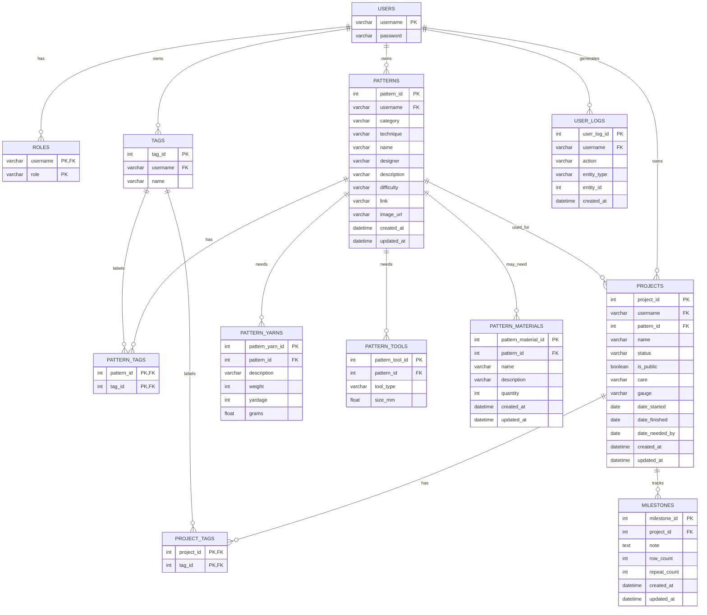

# Crochet / Knitting Project Tracker ERD

This proposed entity relationship diagram is based on `SPECS.md`. It keeps
patterns, projects, yarn, tools, photos, milestones, and logs tied to the owning
user, while still allowing admins to query and manage the same records.

## Design Notes

- This ERD_SIMPLIFIED.md file is a scaled back version of ERD.md - I made the larger ERD.md
  to encompass everything I want this project to do for myself. However, as I have been working
  through this project it is clear that the inventory work for a project is more in-depth than
  I am able to do currently within the confines of this project's requirements.
- `PATTERN_YARNS`, `PATTERN_TOOLS`, and `PATTERN_MATERIALS` describe what a pattern
  recommends or may require.
- `PATTERN_MATERIALS` is connected with `may_need` because non-yarn materials are
  optional checklist items. A project can include only the materials that are
  relevant to that user's version of the pattern.
- `TAGS`, `PATTERN_TAGS`, and `PROJECT_TAGS` support reusable user-owned tagging
  for patterns and projects without storing duplicate comma-separated tag text on
  either entity. Tag names are scoped to a user instead of being globally unique.
- Admin access does not require separate ownership tables. Admin permissions can
  come from `ROLES`, while admin views and analytics can query across the same
  user-owned projects, patterns, stash, and log tables.
